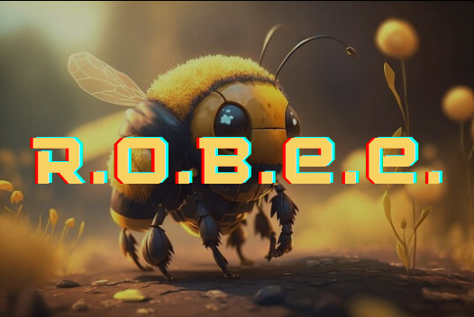
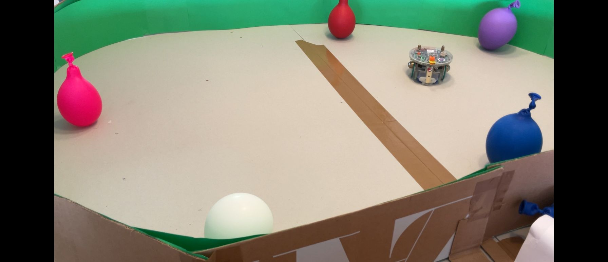

# R.O.B.E.E
<p align = "center">
 
</p>

A robotic bee equipped with camera, microphone, speaker and TOF sensor.

Embedded Systems and Robotics semester project at [EPFL](https://www.epfl.ch/)
 using the e-puck 2 robot from [GCtronic](https://www.gctronic.com/).

 ## Features
- Detection and seeking of balloons of different colors in its environment (camera, motors, TOF sensor)
- Detection of vocal commmands between MOVE, COMMUNICATE and STOP (microphone)
- [Miel pops](https://www.youtube.com/watch?v=NZEbiHUrS9A) music playing (speaker)

## Requirements

### VSCode

#### Libraries
- [e-puck2_main_processor](https://github.com/e-puck2/e-puck2_main-processor) ([wiki](https://www.gctronic.com/doc/index.php?title=e-puck2_robot_side_development))


### Hardware

| Peripheral            | Model    |
|------------           |----------|
| Robot                 | [e-puck2 (GCtronic)](https://www.gctronic.com/e-puck2.php) |
| Needle support        | [3d_printed_support](https://github.com/EPFL-MICRO-315/tps-2024-group-gauderon-akeddar/tree/BeeTest/3d_printed_parts) |
| Needle                | -        |
| Inflatable balloons   | -        |

## How to setup

First fetch R.O.B.E.E's code:
```
git clone https://github.com/EPFL-MICRO-315/tps-2024-group-gauderon-akeddar.git
```
As a side note, github will ask for the username and the "password". What is called password is in reality a personal access token that needs to be generated on github: click on your profile in the top right corner -> "settings" -> left columns on the bottom, "developer settings" -> personal access tokens (classic ones) -> generate such a token, and paste it as the password.

Then from the control panel press on "(Link Library e-puck2_main-processor)".

Next from the BeeSim folder:
```
make
```
Then, plug your e-puck to your computer. On the side bar in Vscode, you will see a button "Run and Debug", press it.

Finally, you will see a green arrow and next to it "BMP launch to main", press it and let the magic opere ! 

## Demo
### Live demo
[](https://www.youtube.com/watch?v=BzsUUsXOwNg&t=9s)


  
 

